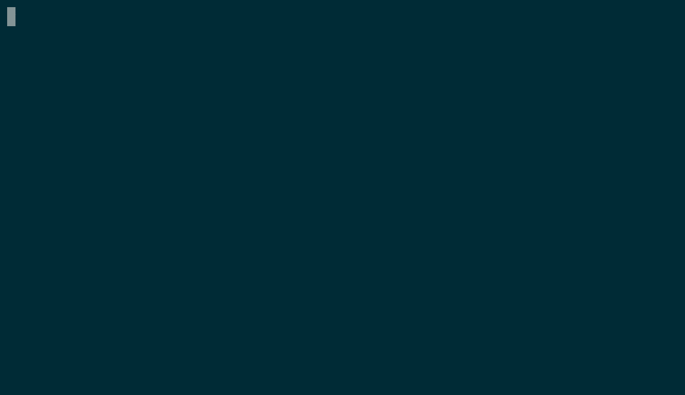

# Magda

This repo was originally developed as a test application for
[Blimp](https://kelda.io/blimp) (a development environment that runs your
containers in the cloud, while keeping the exact same configuration and
workflow as Docker Compose).

It contains examples of several useful Docker Compose patterns, such as [Data
Containers](TODO).

This repo works with `docker-compose up` as well without any modifications.

## Usage

### Step 1: Clone the repo

```shell
git clone https://github.com/kelda/magda
cd magda
```

### Step 2: Setup Blimp (if you want to run docker-compose.yml in the cloud)

```shell
# Install the Blimp CLI
curl -fsSL 'https://kelda.io/get-blimp.sh' | sh

# Create an account
blimp login
```

### Step 3: Boot the docker-compose.yml

```shell
blimp up
```

Or run `docker-compose up` to run it locally.

Both commands boot the `docker-compose.yml`, and sets up the declared volumes
and localhost tunnels.



### Step 4: Test a code change

Wait for all the containers to boot. Note that you may see some errors from the
indexer and registry-api service, but that's fine.

1. View the Magda homepage at [localhost:8080](http://localhost:8080).
1. View the bug by searching for "Australia". You should see a Syntax Error.
1. Fix the bug by changing `this_value_is_wrong` on line 104 of
   `web-server/src/index.js` to `v0`. Once you save, your change will get
   synced into the container by a host volume. Nodemon will then notice the
   file change, and restart your code.
1. Confirm the fix worked by refreshing [the search](http://localhost:8080/search?q=australia).

## Credits
* This example repo was adapted from code from the official
[Magda](https://github.com/magda-io/magda) project. 
